# Plotting with `diagPlotter`

This page summarizes common tasks and provides ready-to-run snippets with **real examples** based on the files in `data/`. Each snippet now saves a figure into `docs/assets/figs/` and embeds it below.

It complements the auto-generated API in **API Reference → plotting**.

---

## How to generate all figures automatically

A helper script `scripts/make_figs.py` is provided. Run from the repository root:

```bash
python scripts/make_figs.py
```

This will generate all figures into `docs/assets/figs/` and ensure they match the examples below. The script includes **robust fallbacks**: if some variables (`idqc`) or channels (e.g. channel 7) are missing, it will retry with safer defaults.

---

## Installation

```bash
pip install mkdocs-material mkdocstrings[python] matplotlib numpy pandas
# Optional for maps:
pip install cartopy geopandas shapely pyproj
```

---

## Quickstart

```python
from readDiag.reader import diagAccess
from readDiag.plotting import diagPlotter

conv = diagAccess("data/diag_conv_01.2024013018")
p = diagPlotter(conv)
ax = p.plot_observation_counts("t", title="Counts for T")
ax.figure.savefig("docs/assets/figs/quickstart_conv_counts.png", dpi=150)

rad = diagAccess("data/diag_amsua_n15_03.2024013018")
pr = diagPlotter(rad)
ax = pr.plot_channel_stats_rad(metric="omf", agg="mean", marker="o")
ax.figure.savefig("docs/assets/figs/quickstart_rad_stats.png", dpi=150)
```

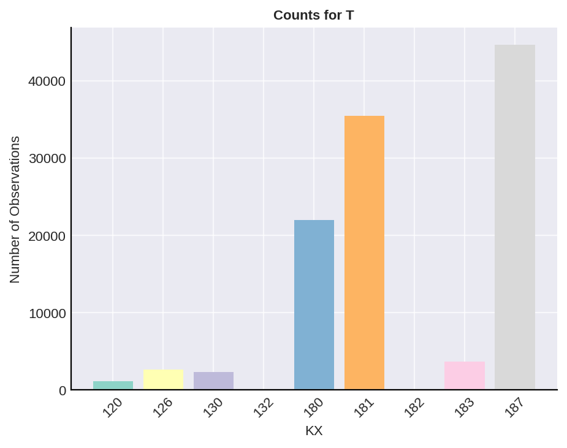{ width="49%" }
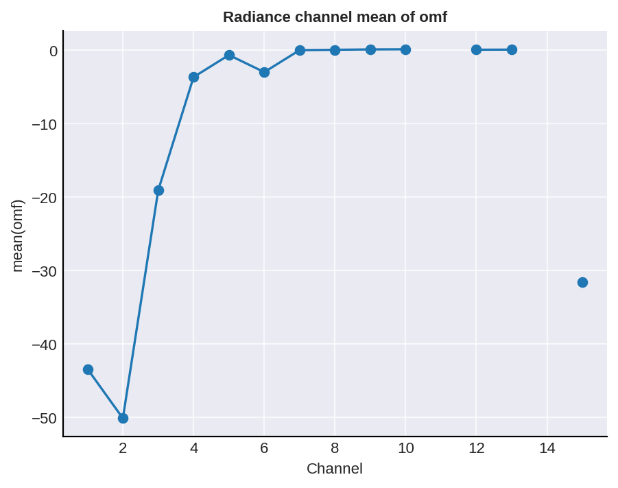{ width="49%" }

---

## Styling

```python
ax = p.plot_kx_count(title="Total Observations by KX", rotation=45, zero_line=False)
ax.figure.savefig("docs/assets/figs/styling_kx_count.png", dpi=150)
```

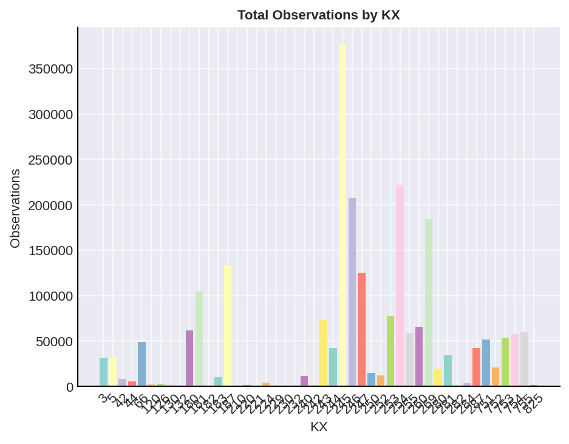

---

## Conventional diagnostics

### Histogram for one KX

```python
ax = p.plot_hist_conv("t", 120, col="omf", bins=40, color="tab:blue",
                     title="Histogram O–F – T @KX120", xlabel="O–F", ylabel="Frequency")
ax.figure.savefig("docs/assets/figs/conv_hist_t_kx120.png", dpi=150)
```

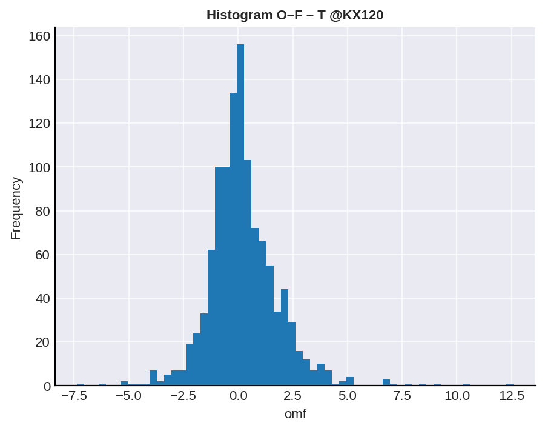

### Boxplots across KX

```python
ax = p.plot_boxplot_kxs_conv("t", col="omf", color="black",
                            title="O–F distribution across KX", xlabel="KX", ylabel="O–F")
ax.figure.savefig("docs/assets/figs/conv_boxplot_t.png", dpi=150)
```

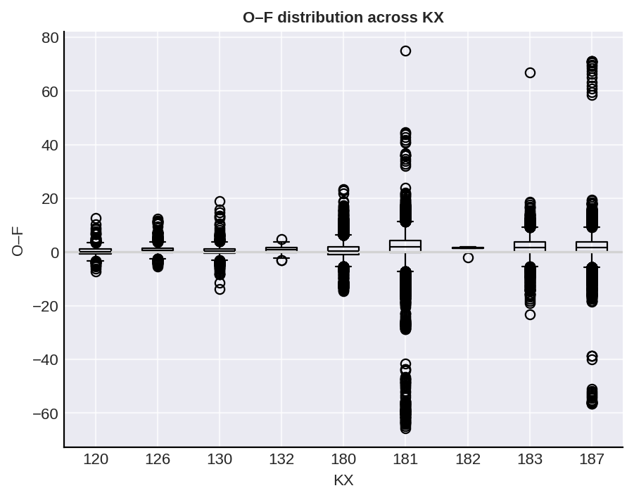

### Counts per KX / variable

```python
ax = p.plot_observation_counts("uv", title="Counts for UV", rotation=45)
ax.figure.savefig("docs/assets/figs/conv_counts_uv.png", dpi=150)

ax = p.plot_kx_count(title="Total Observations by KX", rotation=45)
ax.figure.savefig("docs/assets/figs/conv_counts_kx.png", dpi=150)

ax = p.plot_variable_count(title="Total per variable", xlabel="Variable", ylabel="Count")
ax.figure.savefig("docs/assets/figs/conv_counts_var.png", dpi=150)

ax = p.plot_kx_count_stacked(vars=["t","q","ps"], title="Stacked counts by KX and variable")
ax.figure.savefig("docs/assets/figs/conv_counts_stacked.png", dpi=150)
```

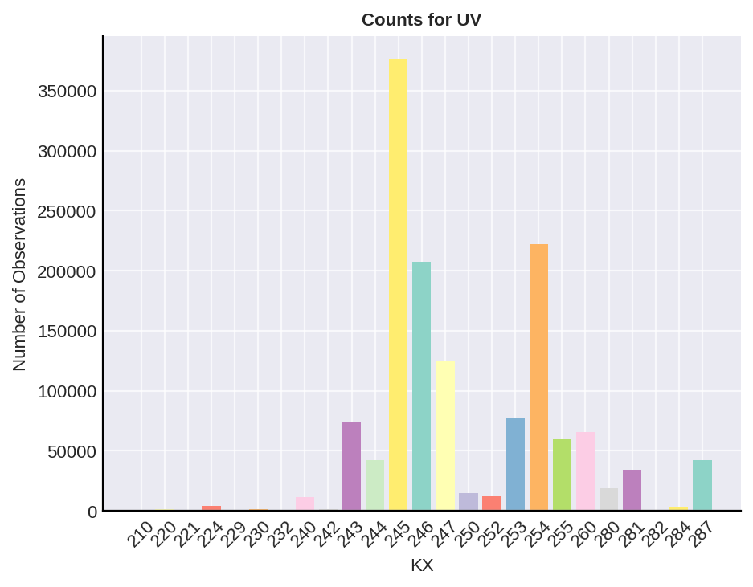{ width="49%" }
{ width="49%" }
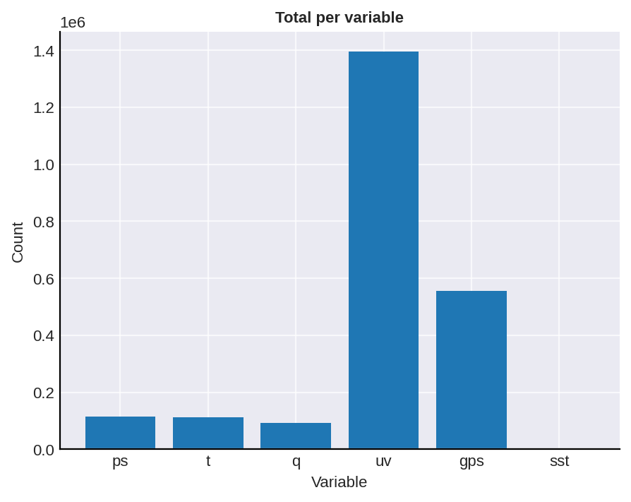{ width="49%" }
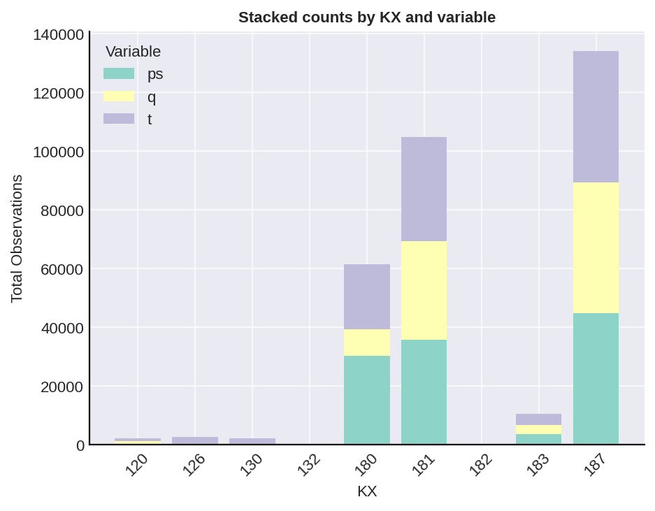{ width="49%" }

### Spatial plot

> ⚠️ **Robust mask:** Some datasets do not contain an `idqc` column. Use `iusev==1.0` (safe everywhere). The script tries `iusev==1.0 and idqc==2.0` first and falls back automatically if needed.

```python
ax = p.plot_spatial_conv("t", 181, param="omf", mask="iusev==1.0",
                        area=[270,-60,330,15], cmap="RdBu_r",
                        title="Spatial O–F (T, KX=181)")
ax.figure.savefig("docs/assets/figs/conv_spatial_t_kx81.png", dpi=150)
```

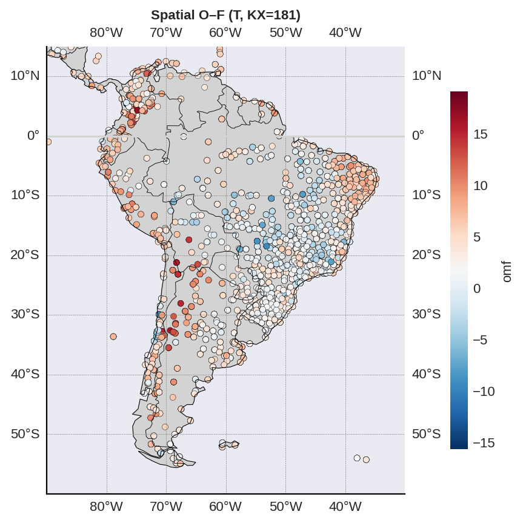

---

## Radiance diagnostics

### Channel statistics

```python
ax = pr.plot_channel_stats_rad(metric="omf", agg="mean", linestyle="--", marker="o",
                              title="Mean O–F per channel", xlabel="Channel", ylabel="mean(O–F)")
ax.figure.savefig("docs/assets/figs/rad_channel_stats.png", dpi=150)
```

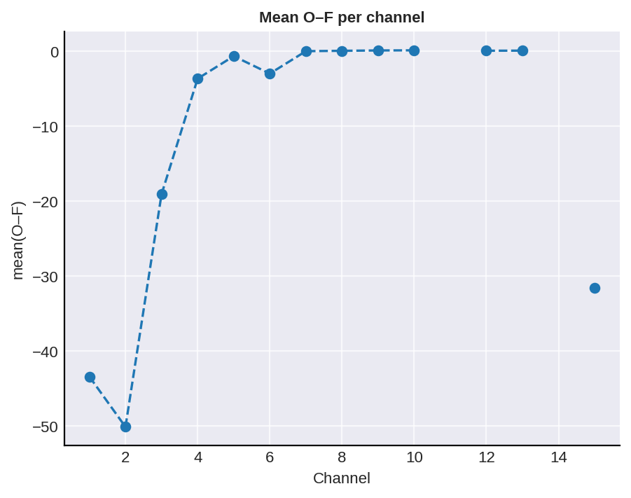

### Distribution for a single channel

> ⚠️ **Channel fallback:** If channel 7 is not available, the script will automatically choose the first valid channel.

```python
ax = pr.plot_omf_distribution_rad(7, corrected=True, bins=60, color="tab:orange",
                                 title="O–F NBC – Channel 7")
ax.figure.savefig("docs/assets/figs/rad_dist_ch7.png", dpi=150)
```

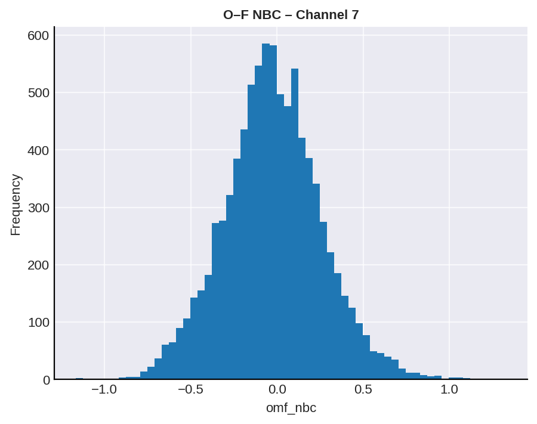

---

## Legacy‑style unified `plot(...)`

```python
# Radiance
ax = pr.plot(varName="amsua", varType="n15", param="omf", mask="(nchan==7) and (iuse>=1)", s=8)
ax.figure.savefig("docs/assets/figs/legacy_rad.png", dpi=150)

# Conventional
ax = p.plot(varName="uv", param="omf", mask="(kx==220) and (iuse==1)", s=10)
ax.figure.savefig("docs/assets/figs/legacy_conv.png", dpi=150)
```

{ width="49%" }
{ width="49%" }

